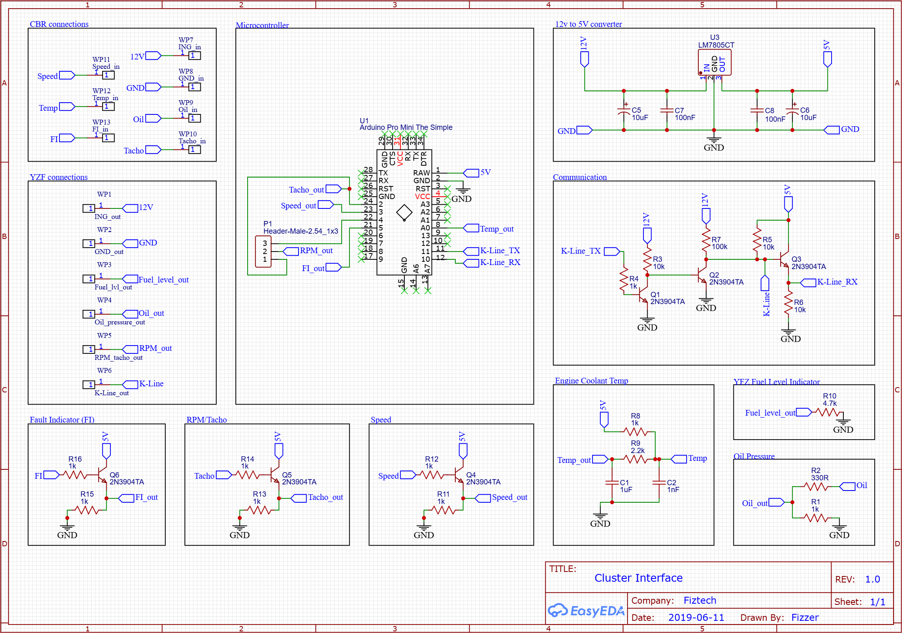

# Buggy Handbook
collection of code and instructions for dune buggy project

## Cluster
#### Hardware interface between honda cbr600f4i ECM and yamaha yzf-r6 cluster
cbr outputs all parameters as analog values, yzf is using k-line serial comm for speed, engine coolant temperature, fault indicator this sketch takes analog parameters processes them, then converts to serial message

#### Indicators
- neutral, turn signals, and high beam function as standard bulb indicators. 
- oil indicator on the YZF is  oil level, CBR uses oil pressure. therefore there is a 30sec delay, requires resisters
- fuel level requires resister

#### Speed Mapping
yamaha cluster accepts speed values from 0-47, internally maps these values to 0-299, it takes 6x messages to send speed value

ie.  actual speed is 21kmh, which falls between 18kmh(index:3) and 24kmh(index:4) therefore we need to send 3x messages with speed value:4, then send 3x messages with speed value:3 to get desired result 21 on cluster

#### Schematic

## Part list
| Type                | Reference |
|---------------------|-----------|
| Front Brake Disks   | 2006 Polaris Hawkeye 300 2wd Front Brakes |
| Front Calipers      | - 2014-2022 Polaris RZR XP 1000 Rear Brake Caliper  - Flange bolts m10x1.25 20mm 10.9 | 
| Front Wheel Bearings | - Inner: 25x52x15 Sealed |
| Rear Wheel Bearings | 1999 VW Golf Front Wheel Bearing pfw130 |
| Sprockets           | Front: sprocketspecialists.com CBR600F4i 11T  Rear: 1989 Yamaha FZR600 46 Tooth 520 pitch |
| Axles               | 1998 Audi A4 2.8L Auto  EMPI Only!! Shafts ASM.  80-9020  80-9021  80-9032  80-9033  <ins>EMP CV Ends</ins>  Inner: 87-9086 (34 spline)  Outer: 87-9046 (28 Spline Hub,27 Spline Shaft)
| Wheels              | - Front: Quadboss Governor Wheel 12x7, 4/110, 5+2  - Rear: Quadboss Governor Wheel 12x7, 4/110, 2+5 |                      
| Shifter Bearings    | - 1/2" pillow block  - F6800-2RS Flanged Ball Bearing 10x19x5mm  - 8mm Rod End Bearing Female |
| Engine              | 2001 Honda CBR600F4i |
| EFI Module          | Power Commander IIIr Serial |
| Radiator            | 2000 Honda Civic |
| Cluster Connectors  | TYCO 174046-2 (Yamaha YZF-R6)  2.8MM 9 PIN WAY (Honda CBR600F4i) |

